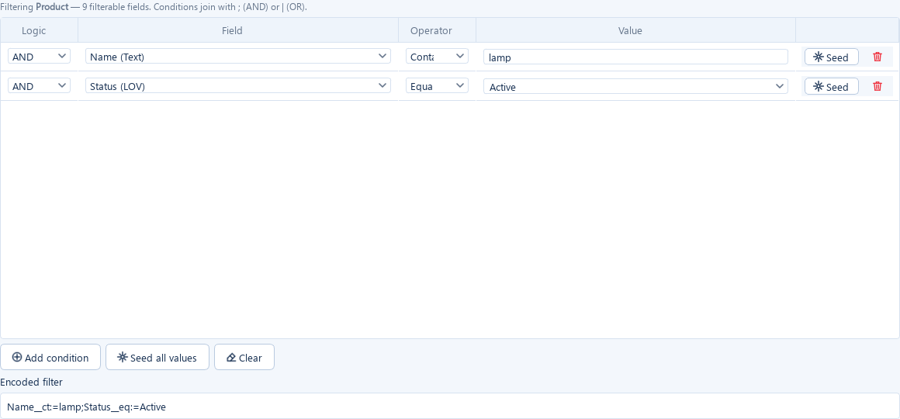
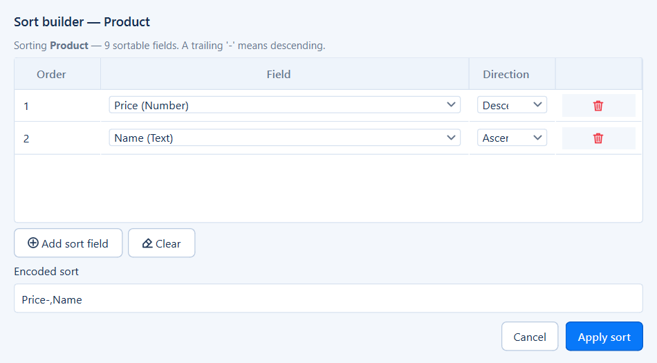

<div align="center">

# Rest Tester

**A desktop workbench for exploring, testing and load-testing REST APIs.**

Rest Tester turns an API catalog into a guided workspace: browse every endpoint, build requests from
their schemas, verify responses, organise regression suites, drive requests from CSV data and
measure behaviour under load. Everything runs in one native app on your machine.

[](LICENSE)


[](https://priyankdalal.github.io/rest-tester/)

[Website](https://priyankdalal.github.io/rest-tester/) ·
[Features](#features) ·
[Quick start](#quick-start) ·
[Screenshots](#screenshots) ·
[Documentation](#documentation) ·
[Contributing](#contributing) ·
[License](#license)


</div>

---

## Table of contents

- [Why Rest Tester?](#why-rest-tester)
- [Features](#features)
- [Quick start](#quick-start)
- [Screenshots](#screenshots)
- [Documentation](#documentation)
  - [API Explorer](#api-explorer)
  - [Filter and sort grammar](#filter-and-sort-grammar)
  - [Test Suites](#test-suites)
  - [Data Runner](#data-runner)
  - [Load Studio](#load-studio)
  - [Catalog Builder](#catalog-builder)
  - [Environments and authentication](#environments-and-authentication)
  - [The API catalog format](#the-api-catalog-format)
  - [Local data storage](#local-data-storage)
  - [Keyboard shortcuts](#keyboard-shortcuts)
- [Building a standalone executable](#building-a-standalone-executable)
- [Running the tests](#running-the-tests)
- [Project website](#project-website)
- [Project structure](#project-structure)
- [Contributing](#contributing)
- [License](#license)

---

## Why Rest Tester?

Most REST clients give you an empty URL box. Rest Tester starts from a **catalog** of your API
(services, endpoints, parameters, filterable and sortable fields, enums and payload schemas) and
uses it to build the right UI for every endpoint:

- **Schema-driven, not free-text.** Payloads are rendered as forms with typed fields. Enums become
  drop-downs, flags become checkboxes, and nested objects become groups.
- **Domain-aware query builder.** Each endpoint offers only the fields it can actually filter and
  sort on, and only the operators that make sense for each field's type.
- **Testing is built in.** You go from an ad-hoc request to a saved regression case in one click,
  then to a data-driven batch or a load test.
- **Private and local.** No account and no cloud sync. Requests go straight from your machine to
  your API, and history lives in a local SQLite file.

---

## Features

| | Workspace | What it gives you |
|---|---|---|
| 🔎 | **API Explorer** | Searchable endpoint tree with favourites and recents. It includes filter and sort builders, schema-driven payload forms, seed-data generation, a response viewer, a request timeline waterfall, saved requests and collections, and cURL/Python code generation. |
| ✅ | **Test Suites** | Ordered regression cases with expected status and rich assertions (body, JSON path, headers, timing, response schema). Run analysis, per-case results and a suite waterfall are included. |
| 📊 | **Data Runner** | Drives one endpoint with every row of a CSV file: map columns to parameters and payload fields, validate before sending, run in parallel, then review and export the results. Runs can be saved and reopened. |
| ⚡ | **Load Studio** | Closed-model load tests with ramp-up, steady and ramp-down stages and safety limits. It shows a live dashboard (throughput, latency percentiles, errors, virtual users), a detailed final report and PDF export. Runs can be saved and reopened. |
| 🛠️ | **Catalog Builder** | Creates and edits the catalog: services, endpoints, parameters, schemas, allowed values and filter/sort fields. It can also scan ASP.NET Core service repositories to generate a catalog. |
| 🌐 | **Environments** | Per-environment base URLs, variables, custom headers, TLS and timeout settings, plus managed authentication (OAuth 2.0, Microsoft Entra/B2C, API keys, JWT and more) with automatic token renewal. |
| 🎨 | **Polished desktop UX** | Light and dark themes, a responsive layout and keyboard shortcuts. An About dialog shows version, system and license details. |

---

## Quick start

> **Requirements:** Python 3.11 or newer and Git. Rest Tester runs on Windows, macOS and Linux.

### 1. Clone and install

```bash
git clone https://github.com/priyankdalal/rest-tester.git
cd rest-tester

python -m venv .venv
# Windows
.venv\Scripts\activate
# macOS / Linux
source .venv/bin/activate

pip install -r requirements.txt
```

### 2. Start the demo API (optional, but recommended)

The repository ships with a small, dependency-free **Store** API so you can try every feature
without pointing the app at a real service:

```bash
python examples/demo_store_server.py            # serves http://127.0.0.1:8765
python examples/demo_store_server.py --port 9000 --quiet
```

It serves products, categories, customers and orders with seeded data. It supports filtering,
sorting, paging, field selection, JSON Patch, `HEAD` counts, `problem+json` validation errors,
file downloads and image responses.

### 3. Launch Rest Tester

```bash
python run.py
```

### 4. Load the demo catalog

1. Open **Settings → API catalog → Load catalog…** and choose `examples/store_catalog.json`.
2. Each environment's base URLs are pre-filled from the catalog (for example
   `http://127.0.0.1:8765/catalog/v1/`). Change them under **Environments** if you started the
   demo server on another port.
3. Back in **API Explorer**, pick `GET /Product` under **Catalog** and click **Send**. Then open the
   `Filter` row's builder on the **Query** tab to try a filter.

That's it: you're exploring a fully described API.

---

## Screenshots

<table>
  <tr>
    <td width="50%"><br><sub><b>API Explorer</b>: endpoint tree, request builder and response viewer</sub></td>
    <td width="50%"><br><sub><b>Dark theme</b>: every workspace supports light and dark</sub></td>
  </tr>
  <tr>
    <td><br><sub><b>Query builder</b>: only the filterable fields and valid operators</sub></td>
    <td><br><sub><b>Sort builder</b>: ordered, per-field direction</sub></td>
  </tr>
  <tr>
    <td><br><sub><b>Payload form</b>: rendered from the payload schema</sub></td>
    <td><br><sub><b>Raw JSON</b>: always available and authoritative</sub></td>
  </tr>
  <tr>
    <td><br><sub><b>Test Suites</b>: run analysis across every case</sub></td>
    <td><br><sub><b>Case result</b>: assertion-by-assertion outcome</sub></td>
  </tr>
  <tr>
    <td><br><sub><b>Suite timeline</b>: waterfall of the whole run</sub></td>
    <td><br><sub><b>Data Runner</b>: pick an endpoint and a data source</sub></td>
  </tr>
  <tr>
    <td><br><sub><b>Column mapping</b>: bind columns to params and payload</sub></td>
    <td><br><sub><b>Batch results</b>: per-row outcome, timing and export</sub></td>
  </tr>
  <tr>
    <td><br><sub><b>Load Studio</b>: stage-based load profile</sub></td>
    <td><br><sub><b>Live dashboard</b>: throughput, latency and users in real time</sub></td>
  </tr>
  <tr>
    <td><br><sub><b>Final results</b>: min / avg / max for every metric</sub></td>
    <td><br><sub><b>Catalog Builder</b>: describe endpoints visually</sub></td>
  </tr>
  <tr>
    <td><br><sub><b>Environments</b>: base URLs, headers and auth per target</sub></td>
    <td><br><sub><b>About</b>: version, system details and licenses</sub></td>
  </tr>
</table>

---

## Documentation

### API Explorer

The explorer is the home workspace. On the left is the **endpoint tree**, grouped by service.
It supports search (`Ctrl+L`), method and scope filters, favourites and recently used endpoints.
On the right, each endpoint has **Request**, **Documentation**, **Examples** and **Test History**
tabs. The request itself is edited in four sub-tabs:

| Request tab | Purpose |
|---|---|
| **Path** | Path parameters with typed editors and catalog defaults. |
| **Query** | Query parameters. `Filter` and `Sort` rows open the [filter and sort builders](#filter-and-sort-grammar). |
| **Form** | `multipart/form-data` fields. File fields get a **Browse…** button. |
| **Payload JSON** | The raw body. **Payload fields** opens a schema-driven form that writes back to the JSON. |

The header actions are:

- **Send**: issues the request. Its drop-down offers **Send and Verify** (`Ctrl+Enter`), which also
  validates the response against the endpoint's response schema.
- **Add to Test Suite**: captures the current request as a suite case. Its drop-down also offers
  **Open in Load Studio** and **Open in Data Runner**, which carry the same request over.
- **Save Request** and **Favorite**: keep requests in **Saved Requests** and **Collections**.
- **More** (**⋯**): **Generate cURL**, **Generate Python Request** and **Copy URL**.

**Seed data** fills payloads and filters with realistic, type-aware values:

- GUID fields get fresh UUIDs and dates get ISO dates.
- Enum fields get real members only.
- Range operators (`bt`) get two values, and list operators (`in`, `nin`) get several.
- Text operators (`ct`, `sw`, `ew`) get a substring fragment.

The **response viewer** has **Body**, **Headers**, **Timeline**, **Request** and **Validation**
tabs. JSON is syntax-highlighted, images are previewed and file downloads can be saved. The
**timeline** breaks each call into a DNS, TCP connect, TLS and HTTP waterfall.

<p align="center"></p>

### Filter and sort grammar

Rest Tester encodes filters in a compact, URL-friendly grammar that the query builder writes
for you. You can also type it by hand; edits parse back into the builder grid.

```text
Filter = Name__op:=value          one condition
         A;B                      A AND B
         A|B                      A OR  B
Sort   = Name,CreatedDate-        comma separated, trailing "-" = descending
```

| Operator | Meaning | Example |
|---|---|---|
| `eq` / `neq` | equals / not equals | `Status__eq:=Active` |
| `gt` / `gte` / `lt` / `lte` | comparisons | `Price__gte:=10` |
| `bt` | between (two values) | `Price__bt:=10,50` |
| `in` / `nin` | in list / not in list | `Name__in:=Desk,Lamp` |
| `ct` / `nct` | contains / does not contain | `Name__ct:=lamp` |
| `sw` / `ew` | starts with / ends with | `Sku__sw:=SKU-1` |

The operators offered depend on the field's data type, and only fields the catalog marks as
filterable or sortable appear:

| Data type | Operators |
|---|---|
| Text | `eq` `neq` `ct` `nct` `sw` `ew` `in` `nin` |
| Number | `eq` `neq` `gt` `lt` `gte` `lte` `in` `nin` `bt` |
| Date | `eq` `neq` `gt` `lt` `gte` `lte` `bt` |
| Flag (boolean) | `eq` `neq` |
| LOV (enum) | `eq` `neq`, with values chosen from the real enum members |

<p align="center">
  
  
</p>

### Test Suites

A **suite** is an ordered list of test cases. Each case pins one endpoint with its parameters,
payload, expected status and assertions. Any number of cases can target the same endpoint, so
one endpoint can have a happy path, a not-found case and a validation-failure case.

| Assertion group | Assertions |
|---|---|
| Body | contains / does not contain text, matches regex |
| JSON | field equals / not equals / contains, exists / absent, not empty, length equals / at least / at most, type is |
| Headers | header equals, header exists |
| Timing | responds within *N* ms |
| Schema | matches the endpoint's response schema |

Cases can be renamed, duplicated, reordered and individually disabled. A suite run produces a
**run analysis** summarising outcomes and timings across all cases and a detailed **result** for
each case. It also produces a **timeline** waterfall of the whole run. Suites are plain JSON files
in `suites/`, so they diff cleanly and can live in version control.

<p align="center"></p>

### Data Runner

The Data Runner executes one endpoint once per row of a CSV file. It is a step-by-step wizard:

1. **Source**: pick the service and endpoint (with type-ahead search), then load a CSV file.
2. **Mapping**: bind columns to path, query, header and payload fields. Matching names are
   mapped automatically, and values can optionally be parsed as JSON.
3. **Validate**: preview the resolved requests and catch type or required-field problems before
   anything is sent.
4. **Execute & review**: run with configurable concurrency, watch progress and inspect each
   row's status, timing and response. Export the results when you're done.
5. **History**: reopen earlier executions.

Every execution is a **portable SQLite run file** that can be loaded back later.

<p align="center">
  
  
</p>

### Load Studio

Load Studio runs **closed-model load tests** against a single endpoint:

- **Configure**: choose the endpoint with type-ahead search, then build a profile from
  ramp-up, steady and ramp-down stages with think time.
- **Safety & Thresholds**: cap peak virtual users, scenario duration and request timeout. Then
  set pass/fail thresholds (for example error rate, P95 or P99 latency) for the verdict.
- **Live & Results**: the live dashboard shows throughput, average latency, P99, errors,
  completed requests and active virtual users, with charts and per-stage progress. When the run
  finishes, the cards switch to **min / avg / max** summaries.

The final report breaks down every metric, highlights shortcomings and suggests likely causes
and fixes. It can be **exported to PDF** with charts and tables. Runs can be persisted to a
SQLite file and reopened from the Live & Results title bar.

<p align="center">
  
  
</p>

### Catalog Builder

The Catalog Builder (`python run_builder.py`, or **Settings → Open Catalog Builder**) is a visual
editor for the catalog. It covers:

- services and base paths;
- endpoints with method, route, summary and content types;
- path, query, header and form parameters, with allowed-value lists;
- payload and response schemas, including enums, nested objects and arrays;
- filterable and sortable fields with their types and operators.

It can also **generate** a catalog by statically scanning ASP.NET Core service repositories
(`python -m tools.generate_catalog`). It reads controllers, routes, DTOs and entity attributes.
Use `Alt+←` / `Alt+→` to go back and forward through the items you have visited.

<p align="center">
  
  
</p>

### Environments and authentication

Each environment profile has five tabs:

| Tab | Contents |
|---|---|
| **Base URLs** | one URL per service in the loaded catalog |
| **Variables** | name/value pairs substituted into requests |
| **Custom headers** | name/value pairs; `Authorization` and `x-api-key` have one-click presets |
| **Transport** | TLS verification and request timeout |
| **Authentication** | managed credential profiles, service bindings, sign-in and renewal |

Managed authentication obtains tokens and **renews them automatically**:

- **Microsoft identity (MSAL):** Entra ID browser sign-in (PKCE), Azure AD B2C, client credentials.
- **Generic OAuth 2.0:** authorization code + PKCE, client credentials, device code, resource
  owner password, refresh token. This works with Auth0, Okta, Keycloak, Google and others.
- **Static credentials:** bearer token, API key (header or query), Basic, JWT bearer (signed
  locally) and Atlassian ASAP.

> **Note:** static credentials (API keys, bearer tokens, custom headers) are stored in plain text in
> `data/settings.json`. Keep that file out of version control and off shared drives.

<p align="center">
  
  
</p>

### The API catalog format

A catalog is a single JSON file. An abridged example:

```json
{
  "schema_version": 2,
  "name": "Demo Store API",
  "services": [
    {
      "name": "Catalog",
      "default_base_url": "http://127.0.0.1:8765/catalog/v1/",
      "filter_sort_builders": true,
      "endpoints": [
        {
          "id": "f76aeb49ca37",
          "service": "Catalog",
          "controller": "Product",
          "method": "GET",
          "path": "/Product",
          "parameters": [
            { "name": "Filter",   "source": "query", "type": "string?", "required": false },
            { "name": "Sort",     "source": "query", "type": "string?", "required": false },
            { "name": "PageSize", "source": "query", "type": "int",     "required": false, "sample": 25 }
          ],
          "payload": null,
          "filter_entity": "Product",
          "expected_status": "200-299"
        }
      ]
    }
  ],
  "filter_schemas":   { "Product": { "...": "filterable / sortable fields and operators" } },
  "payload_schemas":  { },
  "form_schemas":     { },
  "response_schemas": { },
  "enums":            { }
}
```

The top-level schema maps hold reusable definitions that endpoints reference by name: filter
entities, payload and form data classes, response shapes and enum members.

See [`examples/store_catalog.json`](examples/store_catalog.json) for a complete catalog. It
includes payload schemas, enums, filterable and sortable fields, form uploads and file downloads.
The Catalog Builder reads and writes this format, so you rarely need to edit it by hand.

### Local data storage

| Data | Location | Notes |
|---|---|---|
| Settings and environments | `data/settings.json` | Catalog path, theme and environment profiles. |
| History, saved requests, collections | `data/workspace.db` (SQLite) | History older than 100 days is pruned automatically. |
| Test suites | `suites/*.json` | Plain JSON, friendly to version control. |
| Data Runner / Load Studio runs | `*.db` files you choose | One portable SQLite file per run; never pruned. |

When running from a packaged build, these folders are created next to the executable, which keeps
the app portable.

### Keyboard shortcuts

| Shortcut | Action |
|---|---|
| `Ctrl+Enter` | Send and Verify the current request |
| `Ctrl+L` | Focus the endpoint search |
| `Alt+←` / `Alt+→` | Back / forward through visited items (Catalog Builder) |

---

## Building a standalone executable

Rest Tester is packaged with [PyInstaller](https://pyinstaller.org/):

```powershell
pip install -r requirements-dev.txt
pyinstaller --noconfirm --clean RestTester.spec
```

The build is written to `dist/RestTester/`. Keep the whole folder together, because it contains
the Qt runtime. The application icon is generated at build time by `python -m tools.make_icon`.

The packaged build **ships without a catalog** on purpose. On first launch the explorer explains
how to load one from **Settings**, or how to create one with the Catalog Builder.

---

## Running the tests

The project has a large pytest suite covering the UI, request building, the filter grammar,
assertions, the runners and packaging.

```powershell
pip install -r requirements-dev.txt

# Headless Qt (Windows PowerShell)
$env:QT_QPA_PLATFORM = "offscreen"
$env:QT_QPA_FONTDIR  = "C:\Windows\Fonts"   # real font metrics for layout tests

python -m pytest                           # full suite, parallel via pytest-xdist
python -m pytest tests/test_load_testing_ui.py -q
```

On macOS or Linux, use `export QT_QPA_PLATFORM=offscreen` and point `QT_QPA_FONTDIR` at a system
font directory (for example `/usr/share/fonts`).

---

## Project website

The website lives in [`docs/`](docs). It is plain HTML and CSS with no build step, and it reuses
the screenshots in `docs/images/`. To publish it, open **Settings → Pages** in your GitHub
repository, choose **Deploy from a branch**, then select your branch and the `/docs` folder. The site
will be served at `https://<user>.github.io/rest-tester/`.

If you fork the project or use a custom domain, replace the base URL in `docs/` first.
[`docs/images/README.md`](docs/images/README.md) lists every place it appears, along with the
screenshot and SEO conventions.

---

## Project structure

```text
rest-tester/
├── run.py                     # launches Rest Tester
├── run_builder.py             # launches the Catalog Builder on its own
├── api_tester/                # application package
│   ├── main.py                #   startup, splash, main window
│   ├── catalog.py             #   catalog model and loader
│   ├── schema_editor.py       #   schema-driven query / sort / payload editors
│   ├── widgets.py, theme.py   #   shared widgets and light/dark themes
│   ├── about.py, branding.py  #   About dialog, name, version, license
│   ├── authentication.py      #   managed authentication providers
│   ├── execution/             #   HTTP execution and timing
│   ├── scanners/              #   source scanners used by the catalog generator
│   ├── data_runner/           #   Data Runner workspace
│   ├── load_testing/          #   Load Studio workspace
│   └── assets/                #   icons and bundled license text
├── tools/                     # catalog generator, schema extractor, icon builder
├── examples/                  # demo Store API server and catalog
├── suites/                    # saved test suites (JSON)
├── data/                      # settings, local database, default catalog
├── docs/                      # project website (GitHub Pages)
│   └── images/                #   screenshots shared by the README and the website
├── tests/                     # pytest suite
├── RestTester.spec            # PyInstaller build definition
├── requirements.txt
└── requirements-dev.txt
```

---

## Contributing

Contributions are welcome! To get started:

1. **Fork** the repository and create a feature branch: `git checkout -b feature/my-change`.
2. Install the dev dependencies: `pip install -r requirements-dev.txt`.
3. Make your change and **add or update tests** under `tests/`.
4. Run the test suite (see [Running the tests](#running-the-tests)) and make sure it passes.
5. Open a pull request that describes the change. Include screenshots for UI changes.

Guidelines:

- Keep changes focused. One feature or fix per pull request.
- Follow the existing code style: type hints, small widgets and shared helpers from `widgets.py`.
- UI changes must work in both the light and dark themes and at narrow window widths.
- Use the demo Store server (`examples/demo_store_server.py`) to reproduce issues without a real backend.

Found a bug or have an idea? Please [open an issue](https://github.com/priyankdalal/rest-tester/issues).
Include your version, which you can copy from **? → About → System → Copy details**.

---

## License

Rest Tester is free software, licensed under the
**[GNU General Public License v3.0 or later](LICENSE)** (`GPL-3.0-or-later`).

The license is GPL because the application is built on **PyQt6**, which is distributed under the
GPL v3. You may use, study, share and modify Rest Tester. If you distribute modified versions, they
must be released under the same license.

### Third-party components

| Component | License |
|---|---|
| [PyQt6](https://www.riverbankcomputing.com/software/pyqt/) / Qt 6 | GPL-3.0 |
| [requests](https://requests.readthedocs.io/) | Apache-2.0 |
| [MSAL for Python](https://github.com/AzureAD/microsoft-authentication-library-for-python) and msal-extensions | MIT |
| [PyJWT](https://pyjwt.readthedocs.io/) | MIT |
| [cryptography](https://cryptography.io/) | Apache-2.0 OR BSD-3-Clause |

The full list, with the versions actually in use, is shown under **? → About → Licenses**.

<div align="center">
<sub>Made with ❤️ and PyQt6 · © 2026 Rest Tester contributors</sub>
</div>
